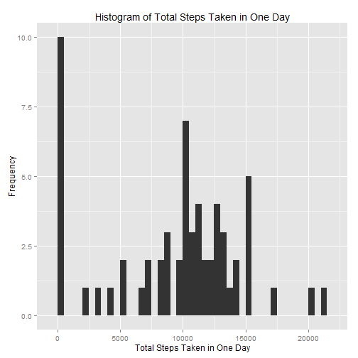
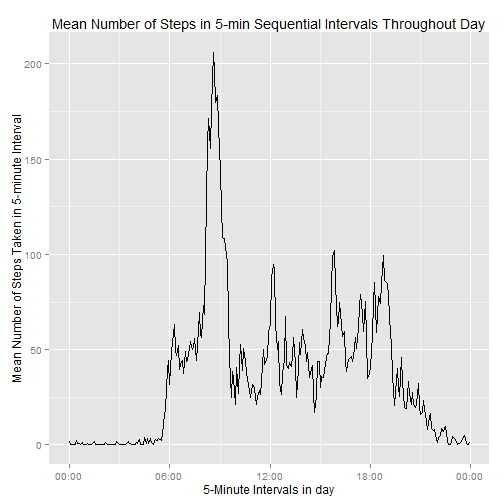
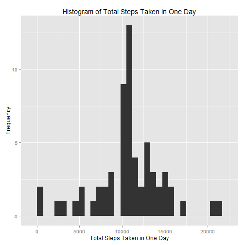
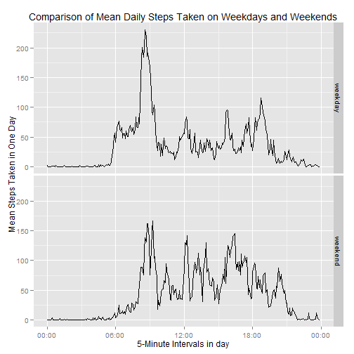

## Reproducible Research: Peer Assessment 1

Setting global default options for document

```r
knitr::opts_chunk$set(echo=TRUE, results='asis')
```


## 1. Loading and preprocessing the data
Navigate to working directory and load data.


```r
setwd("~/sof/datsci/coursework/5.ReproducibleResearch/Assign.1/RepData_PeerAssessment1")
if(!file.exists('./data/activity.csv')){
    print("No Data File Present")
} else {
      dat1 <- read.csv("./data/activity.csv")
      print("Data Loaded")
      }
```

[1] "Data Loaded"

Process date and time data into time class object so that they can be appropriately handled.  
Create a new variable called 'time' to reflect the 5 minute time of day intervals.


```r
timeH.M <- formatC(dat1$interval/100, 2, format='f')
dat1$date <- as.POSIXct(dat1$date, format='%Y-%m-%d', tz='GMT')
dat1$time <- as.POSIXct(timeH.M, format="%H.%M")
```

                            
## 2. What is mean total number of steps taken per day?
Calculate mean steps taken for each day.  Plot the mean daily steps as a function of date.  Return the mean and median steps taken as a function of date.  


```r
stepsDay <- tapply(dat1$steps, dat1$date, sum, na.rm=TRUE)
library(ggplot2)
qplot(stepsDay, xlab='Total Steps Taken in One Day', ylab='Frequency', binwidth=500, main='Histogram of Total Steps Taken in One Day')
```

 

```r
mean(stepsDay)
```

[1] 9354

```r
median(stepsDay)
```

[1] 10395

```r
dailyMean <- mean(stepsDay)
```


## 3. What is the average daily activity pattern?
Calculate mean steps taken for each 5 minute interval averaging over the dates in the dataset.  Ignore obervation with NAs in the steps variable.  Plot the mean number of steps as a function of the 5 minute interval time of day.


```r
dat1a <- dat1[!is.na(dat1$steps),]
library(plyr)
```

```
## Warning: package 'plyr' was built under R version 3.1.2
```

```r
# Calculate average steps for each of 5-minute interval during a 24-hour period
meanStepsByInt <- ddply(dat1a,~time, summarise, mean=mean(steps))
library(scales)
ggplot(meanStepsByInt, aes(time, mean)) + 
      geom_line() +
      xlab('5-Minute Intervals in day') +
      ylab('Mean Number of Steps Taken in 5-minute Interval') +
      ggtitle('Mean Number of Steps in 5-min Sequential Intervals Throughout Day') +
      scale_x_datetime(labels=date_format(format='%H:%M'))
```

 

Report on the most active time of day as being the 5 minite time interval with the largest average number of steps taken.


```r
mostActive <- format(meanStepsByInt$time[which.max(meanStepsByInt$mean)], format='%H:%M %p') 
```

Most active time of the day is at 08:35 AM


## 4. Imputing missing values
Duplicate the dataset to create a new dataset. If data in steps variable contains NAs then the avergae value for that interval will be substituted into the dataset in place of the NA. Identify the NA's and substitute with the corresponding interval averge.  


```r
dat2 <- dat1
for(i in 1:nrow(dat2)){
      if(is.na(dat2$steps[i])){
            dat2$steps[i] <- meanStepsByInt$mean[meanStepsByInt$time == dat2$time[i]]
      }
}
```

Having substituting average values in place of NAs recalculate the daily mean and median for steps taken.


```r
stepsDay2 <- tapply(dat2$steps, dat2$date, sum, na.rm=TRUE)
qplot(stepsDay2, xlab='Total Steps Taken in One Day', ylab='Frequency', binwidth=700, main='Histogram of Total Steps Taken in One Day')
```

 

```r
mean(stepsDay2)
```

[1] 10766

```r
median(stepsDay2)
```

[1] 10766

```r
dailyMean2 <- mean(stepsDay2)
dailyMeanDelta <- dailyMean2-dailyMean
```

The affect on the daily mean number of steps taken when ingnoring NAs compared to substituting NAs with average interval values is 1411.9592 steps.  (Note: A positive number indicates that the mean is higher in the dataset with substituted values in place of NAs.)  


## 5. Are there differences in activity patterns between weekdays and weekends?
Define a weekday as being Monday through Friday, and assign a variable called 'weekday' to the dataset. This variable takes the value 'weekday' for Monday through friday, and 'weekend' for Saturday and Sunday. 


```r
dat2$jour[weekdays(dat2$date) %in% c('Monday', 'Tuesday', 'Wednesday', 'Thursday', 'Friday')] <- 'weekday'
dat2$jour[weekdays(dat2$date) %in% c('Saturday', 'Sunday')] <- 'weekend'
dat2$jour <- as.factor(dat2$jour)
```

Plot the average daily steps taken as a function of the the 5 minute intervals faceted for data collected on weekdays and on wekends. 


```r
stepsDay_jour <- ddply(dat2, .(time,jour), summarise, mean=mean(steps))

ggplot(stepsDay_jour, aes(time, mean)) + 
      geom_line() +
      xlab('5-Minute Intervals in day') +
      ylab('Mean Steps Taken in One Day') +
      scale_x_datetime(labels=date_format(format='%H:%M')) +
      ggtitle('Comparison of Mean Daily Steps Taken on Weekdays and Weekends') +
      facet_grid(jour~.)
```

 
